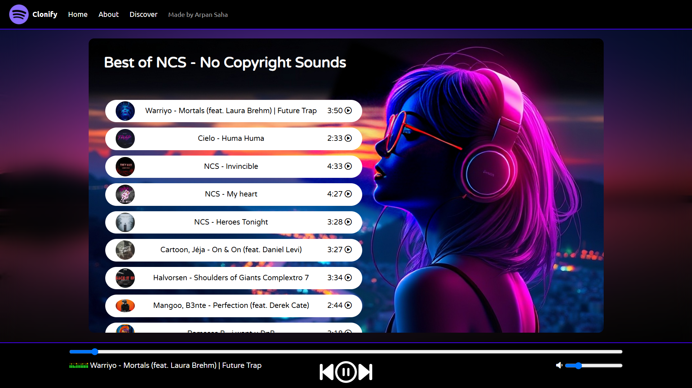

# 🎶 Clonify - Your Favourite Music is Here! 🎶

<b>Clonify</b> is a web-based music player designed to mimic popular music streaming services. It offers a selection of No Copyright Sounds (NCS) tracks, with a sleek and interactive UI for browsing and playback. Enjoy your favorite tunes with a simple and intuitive interface!

## 📋 Table of Contents
- [✨ Features](#-features)
- [📂 Project Structure](#-project-structure)
- [🚀 Getting Started](#-getting-started)
- [⚙️ Usage](#️-usage)
- [📸 Screenshots](#-screenshots)
- [🛠️ Technologies Used](#-technologies-used)
- [🤝 Contributing](#-contributing)

## ✨ Features
- 🎵 **Music Playback**: Play and pause songs, seek within a track, and adjust volume.
- 🎧 **Track Selection**: Choose from a curated list of popular NCS songs.
- 🎚️ **Volume Control**: Adjust volume levels with visual indicators.
- ⏭️ **Skip and Replay**: Navigate between tracks using Next and Previous buttons.
- 🌄 **Dynamic UI**: Interactive elements and animations for a smooth user experience.

## 📂 Project Structure
- **index.htm**: The main HTML file that structures the Clonify player UI and components.
- **style.css**: Custom CSS styles for a modern and responsive design.
- **script.js**: JavaScript for handling song playback, user interactions, and UI updates.

## 🚀 Getting Started
1. Clone this repository:
    ```bash
    git clone https://github.com/your-username/clonify.git
    ```
2. Open `index.htm` in your browser to view the player.

## ⚙️ Usage
- **Play/Pause**: Click the play button to start or pause playback.
- **Seek**: Use the progress bar to skip to different parts of the song.
- **Volume**: Adjust the volume slider to control sound levels.

## 📸 Screenshots


## 🛠️ Technologies Used
- **HTML**: For structuring the page.
- **CSS**: For styling and layout.
- **JavaScript**: For dynamic interactions and playback control.

## 🤝 Contributing
This project is made by [Arpan Saha](https://bit.ly/3YGN7OE). We welcome contributions! Please fork this repository, make changes, and submit a pull request.

---

Enjoy the music! 🎶
